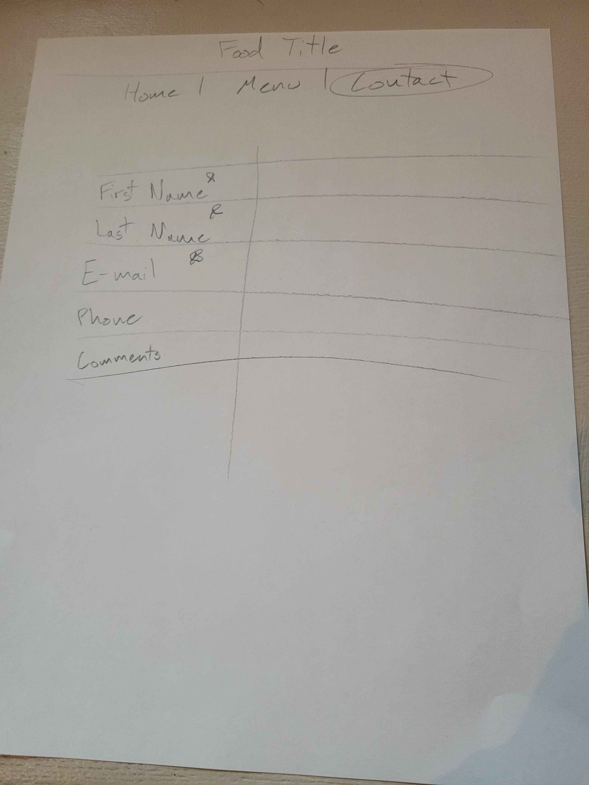

# Pizzeria Bella Vita
# Website

# User Stories
<ul>
<li>As a user, I want to use the navbar to cycle between pages so that I can see all the content.</li>
<li>As a user, I want to fill out a contact form so that I can contact the page owner.</li>
<li>As a user, I want to click through carousel images so that I can see the different food options.</li>
</ul>

# Technologies used
<ul>
<li>Bootstrap</li>
<li>CSS</li>
<li>Github</li>
<li>Html</li>
</ul>

# Wireframes

# To Be Improved Later
Add images for each menu item, a comment section in the contact form, and add a map to the home page.